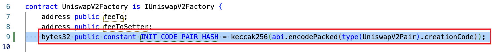
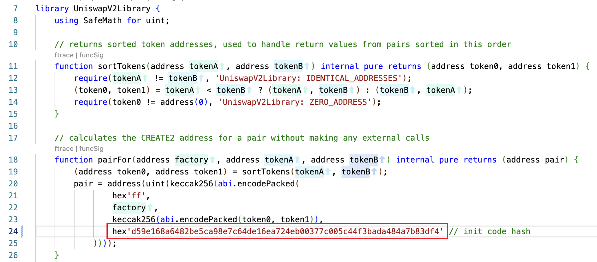
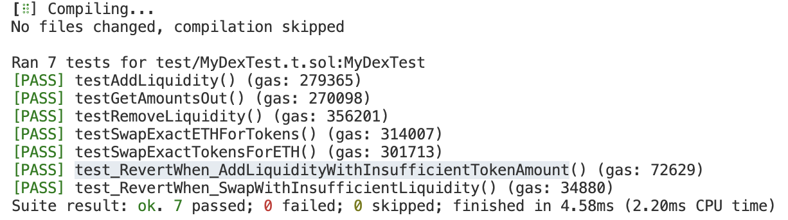

# Foundry DEX

## 安装与配置

# 1. 安装依赖
```bash
# 安装 Uniswap V2 相关依赖
forge install Uniswap/v2-core --no-commit
forge install Uniswap/v2-periphery --no-commit
forge install Uniswap/solidity-lib --no-commit

# 安装 OpenZeppelin 合约
forge install OpenZeppelin/openzeppelin-contracts --no-commit
```

# 2. 配置 Remappings
确保 `remappings.txt` 包含以下映射：

- @openzeppelin/contracts/=lib/openzeppelin-contracts/contracts/
- erc4626-tests/=lib/openzeppelin-contracts/lib/erc4626-tests/
- forge-std/=lib/forge-std/src/
- halmos-cheatcodes/=lib/openzeppelin-contracts/lib/halmos-cheatcodes/src/
- openzeppelin-contracts/=lib/openzeppelin-contracts/
- solidity-lib/=lib/solidity-lib/contracts/
- v2-core/=lib/v2-core/contracts/
- v2-periphery/=lib/v2-periphery/contracts/
- @uniswap/v2-core/=lib/v2-core/
- @uniswap/lib/=lib/solidity-lib/

# 3. 编译需要的合约
- forge build --contracts lib/v2-core/contracts/UniswapV2Factory.sol --use solc:0.5.16 --skip test
- forge build --contracts lib/v2-periphery/contracts/test/WETH9.sol --use solc:0.6.6 --skip test
- forge build --contracts lib/v2-periphery/contracts/UniswapV2Router02.sol --use solc:0.6.6 --skip test

# 4. INIT_CODE_PAIR_HASH 影响添加流动性问题说明
## 问题背景
在 Uniswap V2 中，交易对地址是通过 CREATE2 确定性地计算出来的。这个计算过程需要用到：
1. Factory 地址
2. 两个代币地址
3. pair 合约的初始化代码的哈希值（INIT_CODE_PAIR_HASH）


## 问题原因
- UniswapV2Factory.sol 中计算了实际的 INIT_CODE_PAIR_HASH
- UniswapV2Library.sol 中硬编码了一个预设的哈希值
- 如果这两个值不一致，Router 将无法找到正确的交易对地址


## 解决步骤

1. 编译后运行测试获取实际哈希值：
```bash
forge test -vvv
```

2. 在测试输出中找到 initCodePairHash 的值：

3. 更新 UniswapV2Factory.sol
- 文件位置：lib/v2-core/contracts/UniswapV2Factory.sol
- 找到第9行添加：
    bytes32 public constant INIT_CODE_PAIR_HASH = keccak256(abi.encodePacked(type(UniswapV2Pair).creationCode));

4. 更新 UniswapV2Library.sol：
- 文件位置：lib/v2-periphery/contracts/libraries/UniswapV2Library.sol
- 找到第24行：`hex'd59e168a6482be5ca98e7c64de16ea724eb00377c005c44f3bada484a7b83df4'`
- 将这个值替换为测试输出的 initCodePairHash 值

## 问题图示

Factory 中计算的实际哈希值


Library 中需要更新的硬编码哈希值

## 验证
更新哈希值后，重新运行测试，确保添加流动性等操作正常工作：
```bash
forge test -vvv
```

# 5. 测试结果

